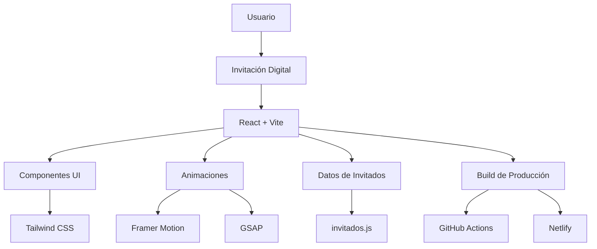
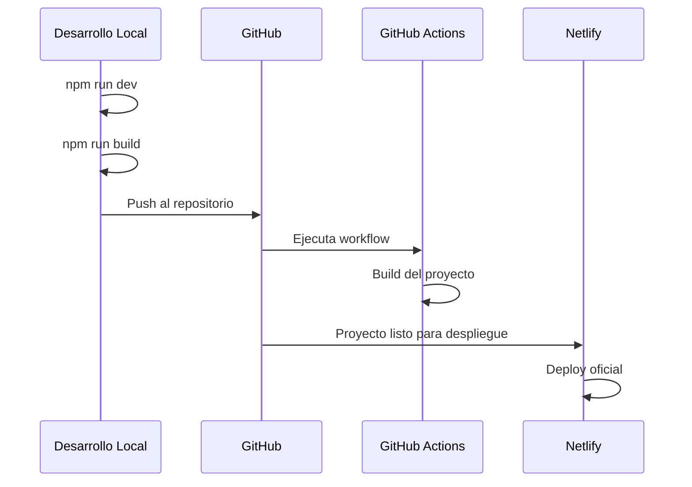

# Invitación XV Tessy

<div align="center">


<br />

Una invitación digital interactiva para una celebración de XV años, desarrollada con React, Vite y Tailwind CSS.

</div>

---

## Vista General

**Invitación XV Tessy** es un proyecto web creado para presentar una invitación digital moderna, elegante y dinámica para una celebración de XV años.

El proyecto fue diseñado como una experiencia visual interactiva, incorporando animaciones, componentes reutilizables, manejo personalizado de invitados y despliegue automatizado.

La aplicación permite organizar invitaciones por familia mediante un archivo `invitados.js`, donde se administra la información de cada grupo invitado y el número de boletos reservados.

---

## Características Principales

- Invitación digital desarrollada como Single Page Application.
- Interfaz moderna y responsiva.
- Animaciones fluidas con Framer Motion y GSAP.
- Estilos construidos con Tailwind CSS.
- Íconos modernos mediante Lucide React.
- Gestión de invitados por familias.
- Asignación personalizada de boletos por invitación.
- Proyecto optimizado con Vite.
- Flujo de integración y despliegue mediante GitHub Actions.
- Despliegue oficial en Netlify.

---

## Stack Tecnológico

| Tecnología | Uso Principal |
|---|---|
| React | Construcción de la interfaz y componentes |
| Vite | Entorno de desarrollo y build optimizado |
| Tailwind CSS | Sistema de estilos utility-first |
| Framer Motion | Animaciones declarativas en React |
| GSAP | Animaciones avanzadas y secuencias visuales |
| Lucide React | Íconos SVG modernos y ligeros |
| ESLint | Análisis estático y calidad de código |
| GitHub Actions | Automatización de build y deploy |
| Netlify | Despliegue oficial del proyecto |

---

## Arquitectura General



---

## Gestión de Invitados

El proyecto utiliza un archivo `invitados.js` para almacenar y organizar las invitaciones.

Este archivo permite estructurar invitados por familia o grupo, además de definir cuántos boletos tiene reservados cada invitación.

Ejemplo conceptual:

```js
export const invitados = [
  {
    familia: "Familia Garay",
    boletos: 4,
    invitacion: "garay"
  },
  {
    familia: "Familia Colin",
    boletos: 3,
    invitacion: "colin"
  }
]
```

Este enfoque permite personalizar la experiencia de cada invitado y mantener una administración sencilla de las invitaciones.

---

## Animaciones e Interactividad

El proyecto aprovecha dos librerías principales para crear una experiencia más atractiva:

### Framer Motion

Utilizado para animaciones declarativas dentro de componentes React, ideal para:

- Apariciones suaves.
- Transiciones entre secciones.
- Animaciones de entrada.
- Efectos visuales controlados por estado.

### GSAP

Utilizado para animaciones más avanzadas, secuencias personalizadas y efectos de mayor precisión visual.

---

## Scripts Disponibles

| Comando | Descripción |
|---|---|
| `npm run dev` | Inicia el servidor de desarrollo |
| `npm run build` | Genera la versión optimizada para producción |
| `npm run preview` | Previsualiza el build de producción |
| `npm run lint` | Ejecuta ESLint para validar el código |

> Nota: el script relacionado con `gh-pages` se conserva en el `package.json`, pero el despliegue actual se realiza mediante GitHub Actions y Netlify.

---

## Instalación y Ejecución Local

Clona el repositorio:

```bash
git clone https://github.com/Yarlick1/tessy.git
```

Entra al proyecto:

```bash
cd invitacion-xv
```

Instala dependencias:

```bash
npm install
```

Ejecuta el servidor de desarrollo:

```bash
npm run dev
```

Genera el build de producción:

```bash
npm run build
```

Previsualiza el build:

```bash
npm run preview
```

---

## Flujo de Desarrollo



---

## Estructura Recomendada del Proyecto

```bash
invitacion-xv/
├── public/
├── src/
│   ├── assets/
│   ├── components/
│   ├── data/
│   │   └── invitados.js
│   ├── App.jsx
│   └── main.jsx
├── .github/
│   └── workflows/
├── package.json
├── vite.config.js
└── README.md
```

---

## Calidad de Código

El proyecto integra ESLint para mantener una base de código más limpia, consistente y fácil de mantener.

```bash
npm run lint
```

Esto ayuda a detectar errores comunes, código no utilizado y posibles problemas durante el desarrollo.

---

## Despliegue

El proyecto cuenta con dos partes importantes dentro del flujo de despliegue:

### GitHub Actions

Se configuró un workflow para automatizar procesos relacionados con el build y despliegue del proyecto desde el repositorio.

### Netlify

Netlify se utiliza como plataforma oficial de despliegue, permitiendo publicar la invitación de forma rápida, estable y accesible.

---

## Dependencias Principales

```json
{
  "react": "^19.2.6",
  "react-dom": "^19.2.6",
  "vite": "^8.0.12",
  "tailwindcss": "^4.3.0",
  "framer-motion": "^12.38.0",
  "gsap": "^3.15.0",
  "lucide-react": "^1.16.0"
}
```

---

## Objetivo del Proyecto

El objetivo principal fue crear una invitación digital personalizada, elegante e interactiva que combinara diseño visual, animaciones modernas y una estructura técnica escalable.

Además de funcionar como invitación, el proyecto sirve como una muestra práctica de desarrollo frontend moderno con React, Vite, Tailwind CSS, animaciones avanzadas y despliegue automatizado.

---

## Autor

Desarrollado por **Ing. Yael Ulrick Garay Colin**


